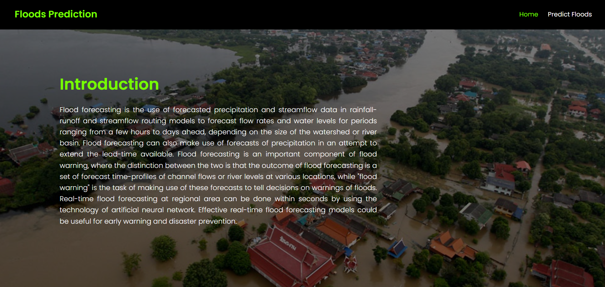

# 🌊 Rising Waters — Flood Prediction System



A machine learning–powered web application that predicts **flood risk** based on meteorological and rainfall parameters. Built with **Flask** and trained using multiple classification algorithms, the system selects the best-performing model automatically.

---
## Demo

**Project Link:** https://drive.google.com/drive/folders/1eTfhTiNZIb38w0vuU7yzkfRbQ2Lvt1nH?usp=sharing

## 📌 Table of Contents

- [Features](#-features)
- [Tech Stack](#-tech-stack)
- [Project Structure](#-project-structure)
- [Dataset](#-dataset)
- [Models Compared](#-models-compared)
- [Input Parameters](#-input-parameters)
- [Getting Started](#-getting-started)
- [IBM Cloud Deployment](#-ibm-cloud-deployment)
- [Screenshots](#-screenshots)
- [License](#-license)

---

## ✨ Features

- 🔮 **Real-time flood prediction** — Enter weather data and get instant flood risk assessment
- 🤖 **Auto model selection** — Trains and compares 4 ML algorithms, picks the best
- 📊 **StandardScaler preprocessing** — Ensures normalized, accurate predictions
- 🎨 **Modern glassmorphism UI** — Beautiful, responsive web interface with Poppins typography
- ☁️ **IBM Cloud ready** — Includes a separate deployment-ready scoring endpoint

---

## 🛠️ Tech Stack

| Layer         | Technology                                         |
|---------------|-----------------------------------------------------|
| **Frontend**  | HTML5, CSS3, Google Fonts (Poppins)                 |
| **Backend**   | Python, Flask                                        |
| **ML Models** | Scikit-learn (Logistic Regression, KNN, Decision Tree, Random Forest) |
| **Data**      | Pandas, NumPy, openpyxl                              |
| **Deployment**| IBM Cloud / Local                                    |

---

## 📁 Project Structure

```
Flood_Prediction_Project/
│
├── Dataset/
│   └── flood dataset.xlsx          # Source dataset
│
├── Training/
│   ├── train_model.py              # Model training & comparison script
│   ├── Flood_Prediction_Colab.ipynb # Google Colab notebook
│   ├── floods.ipynb                # Jupyter notebook
│   ├── check_columns.py           # Column inspection utility
│   └── inspect_data.py            # Data inspection utility
│
├── Flask/
│   ├── app.py                     # Main Flask application
│   ├── floods.save                # Trained model (pickle)
│   ├── transform.save             # Fitted scaler (pickle)
│   ├── model.pkl                  # Alternate model file
│   ├── test_app.py                # Application tests
│   ├── templates/                 # HTML templates
│   │   ├── home.html
│   │   ├── predict.html
│   │   ├── chance.html            # Flood predicted result
│   │   └── no chance.html         # No flood result
│   └── static/                    # CSS & assets
│
├── IBM scoring end point/
│   ├── app.py                     # IBM Cloud–ready Flask app
│   ├── templates/
│   └── static/
│
├── Demo.png                       # Application demo screenshot
└── README.md
```

---

## 📊 Dataset

The dataset (`flood dataset.xlsx`) contains historical weather and rainfall records with a binary **flood** label.

**Features used for prediction:**

| Feature           | Description                    |
|-------------------|--------------------------------|
| `Temp`            | Temperature (°C)               |
| `Humidity`        | Humidity (%)                   |
| `Cloud Cover`     | Cloud Cover (%)                |
| `ANNUAL`          | Annual Rainfall (mm)           |
| `Jan-Feb`         | Jan–Feb Rainfall (mm)          |
| `Mar-May`         | Mar–May Rainfall (mm)          |
| `Jun-Sep`         | Jun–Sep Rainfall (mm)          |
| `Oct-Dec`         | Oct–Dec Rainfall (mm)          |
| `avgjune`         | Average June Rainfall (mm)     |
| `sub`             | Subdivision Rainfall (mm)      |

**Target:** `flood` → `1` (Flood) / `0` (No Flood)

---

## 🤖 Models Compared

The training script evaluates four classifiers and automatically selects the most accurate one:

| Model                  | Type             |
|------------------------|------------------|
| Logistic Regression    | Linear           |
| K-Nearest Neighbors    | Instance-based   |
| Decision Tree          | Tree-based       |
| Random Forest          | Ensemble         |

The best model and its fitted `StandardScaler` are saved as `.save` pickle files for the Flask app.

---

## 📋 Input Parameters

When using the web app, provide:

| Field                      | Example Value |
|----------------------------|---------------|
| Temperature (°C)           | 30.5          |
| Humidity (%)               | 85            |
| Cloud Cover (%)            | 70            |
| Annual Rainfall (mm)       | 1200          |
| Jan-Feb Rainfall (mm)      | 50            |
| Mar-May Rainfall (mm)      | 150           |
| Jun-Sep Rainfall (mm)      | 700           |
| Oct-Dec Rainfall (mm)      | 200           |
| Avg June Rainfall (mm)     | 180           |
| Subdivision Rainfall (mm)  | 250           |

---

## 🚀 Getting Started

### Prerequisites

```bash
pip install flask pandas numpy scikit-learn openpyxl
```

### Train the Model

```bash
cd Training
python train_model.py
```

### Run the App

```bash
cd Flask
python app.py
```

Open **http://127.0.0.1:5000** in your browser.

---

## ☁️ IBM Cloud Deployment

A separate deployment-ready Flask app is available in the `IBM scoring end point/` directory for hosting on **IBM Cloud Foundry** or similar PaaS environments.

```bash
cd "IBM scoring end point"
python app.py
```

---

## 📸 Screenshots

| Home Page | Prediction Result |
|-----------|-------------------|
| Glassmorphism UI with input form | Flood / No Flood result page |

---

## 📝 License

This project is developed as part of a **Smart Bridge** internship program.

---

<p align="center">
  Made with ❤️ using Flask & Scikit-learn
</p>
